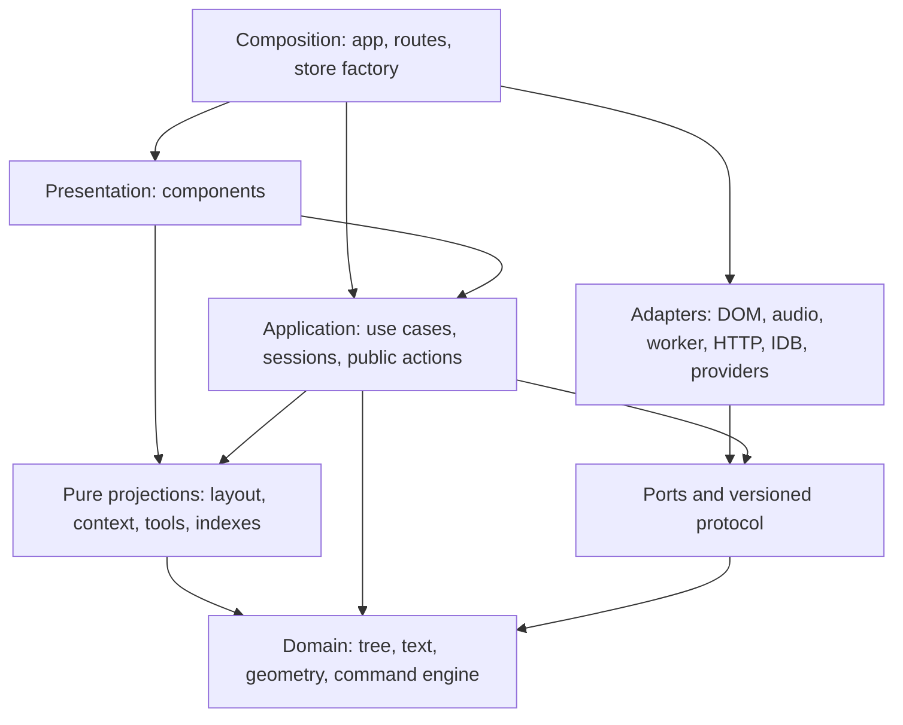

# Architecture Governance

Status: evidence note for protocol `0.2`, reconciled with preview.27 on
2026-08-12. The current contract remains
[`../architecture.md`](../architecture.md) and
[`../engineering.md`](../engineering.md); this note records why those rules
exist, which earlier seams have since closed, and how to improve the system
without importing a generic engine architecture.

## Judgment

Matter does not have an architecture-selection problem. Its product-shaped
kernel is already the right choice: one authoritative `ThoughtTree`, one durable
mutation engine, exact inverses, pure projections, bounded network values, and
transient interaction state outside the document. That resembles the useful
parts of mature engines and editors more than replacing it with ECS, a scene
graph, a service hierarchy, or a collaborative database would.

The highest-leverage mechanical seams from the original audit are now closed:
the import graph is checked in `npm run check`, voice ports are acyclic, browser
and route code meet at neutral protocol contracts, seeded composition is no
longer mistaken for a test fixture, and manual names report failed durability.
The remaining maintenance risks are measured large-tree cost, long-session
history cost at physical browser limits, live-model reliability/abuse controls, and concentration
in three view modules. The next architecture phase should repair a named seam
only when evidence identifies its owner; it should not become a broad rewrite.

This is a code-quality judgment, not evidence that people repeatedly use the
product. The repository proves that the product is substantial and seriously
tested; repeat use and the core path's real-world reliability still require
first-hand product evidence.

## What mature systems are actually buying

The valuable common denominator is not a particular folder tree. Mature systems
pay complexity only to obtain four properties:

1. one owner can answer who may change a fact or release a resource;
2. execution order and commit points are explicit where order affects meaning;
3. an illegal dependency fails mechanically before merge;
4. recovery and stale-result behavior are demonstrated, not inferred.

The following sources are first-party documentation or engineering accounts.
They are prior art, not a request to copy their source or organization.

| Prior art | Why the design is reasonable | Borrow for Matter | Do not copy |
| --- | --- | --- | --- |
| [Unity lifecycle](https://docs.unity3d.com/6000.0/Documentation/Manual/execution-order.html) and [assembly definitions](https://docs.unity3d.com/6000.0/Documentation/Manual/assembly-definitions-intro.html) | A defined loop makes consequential order visible; assembly references constrain module edges and reduce unrelated rebuild work. | Name the prepare, effect, revalidate, commit, publish, and cleanup phases of an async turn; check dependency direction. | A global frame loop, `MonoBehaviour` hierarchy, scene store, or ECS. Matter is event-driven and has one ordered tree, not thousands of homogeneous per-frame entities. |
| [Bevy schedules](https://docs.rs/bevy/latest/bevy/ecs/schedule/) and [deferred commands](https://docs.rs/bevy/latest/bevy/ecs/system/struct.Commands.html) | Systems declare ordering and structural changes cross a deliberate application barrier. | Keep public intent smaller than private mutation and let only the tree engine cross the durable commit barrier. | An ECS, plugin registry, or global scheduler. They add indirection without giving this document model data-locality benefits. |
| [VS Code source organization](https://github.com/microsoft/vscode/wiki/source-code-organization) | Core layers point in one direction, environment-specific code is separated, and extensions see a narrow public surface. | Separate pure domain, application ports, browser/server adapters, presentation, and composition; expose deliberate entry points. | Its dependency-injection service graph, extension host, or process topology at the current scale. |
| [Chromium dependency checks](https://chromium.googlesource.com/chromium/src/+/main/docs/dependencies.md) and [task ownership](https://chromium.googlesource.com/chromium/src/+/main/docs/threading_and_tasks.md) | `DEPS`/`checkdeps` turns modularity into a build property; sequence ownership makes late callbacks and destruction explicit. | Add an import fitness check; require token, cancellation, idempotent cleanup, and late-result no-op tests for external resources. | Browser process isolation, locks, task runners, or a general threading framework. |
| [SQLite architecture](https://www.sqlite.org/arch.html) and [write-ahead logging](https://www.sqlite.org/wal.html) | The pager owns cache, locking, and atomic durability so the B-tree does not; WAL documentation is explicit about checkpoint and growth costs. | Keep IndexedDB atomicity and conflict recovery behind the document repository; measure full-history save and hydration costs. | Calling undo history a WAL or adding checkpoint/compaction before a failure model and measured need exist. |
| [Kubernetes controllers](https://kubernetes.io/docs/concepts/architecture/controller/) and [API resource versions](https://kubernetes.io/docs/reference/using-api/api-concepts/) | Small reconcilers compare desired and observed state; version checks reject updates based on stale observations. | Keep persistence retryable and idempotent; preserve revision/CAS checks for another tab and operation tokens for async work. | A controller for every module, watches, etcd, microservices, or eventual consistency inside one browser document. |
| [React state structure](https://react.dev/learn/choosing-the-state-structure), [Effect lifecycle](https://react.dev/learn/lifecycle-of-reactive-effects), and [Next client boundaries](https://nextjs.org/docs/app/getting-started/server-and-client-components) | Derived state is not duplicated; each Effect is one independent synchronization process; a client entry defines a whole client module graph. | Classify every fact; split view code by owned lifecycle; make provider code server-only and cross-boundary values serializable. | Moving domain rules into hooks or relying on `'use client'` itself as a security boundary. |
| [Redux normalized state](https://redux.js.org/usage/structuring-reducers/normalizing-state-shape) | Stable identities and single ownership avoid contradictory copies; side effects stay outside pure reducers. | Keep the normalized tree, pure mutation engine, and async effect/commit separation. | Putting pointer, audio, transcript, focus, or every cache into one global store. |
| [Figma multiplayer](https://www.figma.com/blog/how-figmas-multiplayer-technology-works/), [Figma reliability](https://www.figma.com/blog/making-multiplayer-more-reliable/), and [Linear sync](https://linear.app/now/scaling-the-linear-sync-engine) | Both evolved a problem-shaped sync boundary from real collaboration and scale constraints; Figma explicitly chose a simpler algorithm where generic OT was unnecessary. | Use replay-equivalence and recovery proofs; define a separate sync contract only if collaboration becomes a real product requirement. | Prebuilding CRDT, cloud authority, event sourcing, or a sync engine for the current local single-document release. |
| [Bazel dependency visibility](https://bazel.build/concepts/visibility) and [Google small changes](https://google.github.io/eng-practices/review/developer/small-cls.html) | Illegal dependency edges fail during analysis, while small coherent changes make review and rollback tractable. | Enforce a lightweight local DAG and repair one ownership seam per change. | Migrating this application to Bazel or adding large-organization approval ceremony. |

## Target ownership model

This is a logical dependency model, not a demand that every box become a package.
Arrows mean “may depend on.” Composition is allowed to know concrete adapters;
inner modules are not.



Consequences:

- the composition root selects fixture or live adapters; production use cases
  never import a fixture;
- browser clients and server routes share a neutral protocol module, not a
  provider directory;
- presentation invokes public application actions and renders projections; it
  does not construct private mutations or own durable recovery;
- adapters depend inward on ports and domain values; domain code never imports
  React, Zustand, DOM, browser, storage, route, or provider code;
- a directory move is warranted only when it makes one of these ownership rules
  enforceable. It is not an end in itself.

## State ownership ledger

Every state item belongs to exactly one class. “Stored in IndexedDB” does not by
itself decide whether something is a cache.

| Class | Examples | Owner and required failure behavior |
| --- | --- | --- |
| Authoritative document | `ThoughtTree`, title, revision | Tree engine constructs changes; document repository publishes atomically; conflicts and failed writes are visible. |
| Durable local choice | active-document pointer; a manual node name if the product promises it survives | A named repository with versioning, rollback, and non-silent failure. It is not evicted as cache pressure. |
| Durable recovery journal | exact inverses and persistence metadata | Persistence owns atomicity and recovery. A supported size/session boundary is measured and explicit; physical quota is not a policy. |
| Transient interaction | pointer capture, lasso, stretch, focus, fold, audio, interim transcript, inquiry exchange | One session/controller owns start, cancel, cleanup, and document-epoch invalidation. Never enters snapshots or command history. |
| Derived projection | visible tree, layout, file rows, context, deterministic labels | Pure or reproducible from authoritative input. Safe to discard and recompute. |
| Derived cache | measured layout maps, provider label result, row projection | Must satisfy the cache contract below. A miss or loss changes cost/latency, never truth. |
| External operation | worker inference, HTTP request, microphone, timer, animation frame | One adapter owns the resource; completion carries an operation token and is revalidated before any commit. |

## Cache contract

Do not create a generic cache layer. For each actual cache, record these fields
next to its implementation or focused reference note:

```text
Owner:          module that creates, reads, invalidates, and observes it
Authority:      always derived; name the authoritative input
Key:            every value whose change makes an entry stale
Bound:          entries, bytes, TTL, or weak reachability
Invalidation:   event or epoch that removes/abandons an entry
Revalidation:   checks repeated on a hit before it is trusted
Fallback:       safe behavior after miss, corruption, or write failure
Observation:    measurement that would justify a more expensive cache
```

Current layout WeakMaps and bounded Maps, and the server label cache with
fingerprint/prompt-version checks, fit this model. The document snapshot is not
a cache. A model-generated label may be a best-effort cache; a manual name is a
human decision and must not share the same silent failure contract.

## Audit snapshot

The following are implementation findings, not architectural guesses.

| Finding | Evidence | Consequence | Direction |
| --- | --- | --- | --- |
| Core mutation boundary is strong | `tree/engine.ts`, `tree/history.ts`, focused command and inverse tests | Durable changes have one authority and stale input can fail atomically. | Preserve; do not replace with a generic transaction or scene system. |
| Import rules are executable | `scripts/check-architecture.mjs` runs in `npm test` over the production graph | A cycle, outward dependency, protocol leak, or provider reach now fails before merge. | Preserve the narrow check; add a rule only when a real seam has stable evidence. |
| Voice contracts are neutral | `voice-port.ts` owns the shared vocabulary; each browser transport depends on it | The two transports are independently readable, testable, and replaceable. | Preserve the port boundary rather than adding a voice framework. |
| Seeded composition is explicit product behavior | `material/seeded-document.ts` composes the initial document and fixed Branch continuations through the tree engine | The seed and fixed continuation are visible, undoable material behavior, not an accidental fixture fallback. | Preserve this preview capability until the bounded transform turn supersedes it; do not remove it merely because historic identifiers contain `fixture`. |
| Browser and route share a neutral wire | `protocol/*-contract.ts` is consumed by HTTP clients and routes | Provider ownership remains server-only while the browser parses the same strict values. | Keep browser code out of `server/`; extend protocol only for versioned wire facts. |
| Manual names have durable failure semantics | `LabelWriteReceipt` and the label driver return a failed write to the editor for retry | A human decision is no longer reported as kept when it never reached disk. | Preserve typed receipts; model-label caching may remain best effort. |
| Three view modules contain several lifecycles | `RootedMaterial`, `CanvasChrome`, and `MaterialFiles` coordinate several kinds of state or browser behavior | Cancellation, exclusivity, focus, geometry, and network ownership deserve review when a current slice touches them. | Treat size as a concentration signal only; extract one owner only when behavior or change evidence identifies an independent lifecycle. |
| Local inference cancellation has an explicit worker lease | active cancellation retires the worker lease, rejects its pending work, and makes late messages inert | A cancelled long job no longer occupies the next turn. | Preserve queued/active cancel, timeout, late-result, and retry proofs; do not generalize it into a worker framework. |
| Undo/Redo retains to physical limits | production history silently evicts nothing and persists exact inverses beside the snapshot | Logical reversibility is settled; long-session serialization and browser quota remain measured implementation limits. | Measure save/hydrate/quota behavior before introducing segmented storage; do not reintroduce silent count or byte eviction. |
| Inquiry retention is a bounded local exception | its generation-checked repository stores terminal exchanges without context and exposes them only through the existing inquiry | Continuity does not become material, archive, or model memory, and no log-management UI is implied. | Preserve the detachable repository and clear/tombstone semantics; add a new surface only after a separate product freeze. |

The codebase is not a hollow scaffold: it contains substantial product code,
104 focused product test files and 14 browser specifications. The three largest view
modules are a concentration signal, not a quality score or a refactoring plan.

## Recommended route

Use a guardrails-first, slice-by-slice route:

1. **Keep the dependency and state ledger true.** Classify every newly persisted
   value before moving files, and keep the existing import fitness check green.
2. **Make newly discovered cheap violations fail.** Add a narrow mechanical
   rule only after its seam is evidenced; do not grow an abstract lint regime.
3. **Repair semantic seams.** Finish live-model reliability and abuse controls,
   measure undo capacity before setting a retention policy, and preserve the
   explicit local-inference cancellation proof.
4. **Review by lifecycle.** When a current slice exposes an independent owner,
   freeze its behavior and extract only that owner. Do not schedule a component
   split from size alone.
5. **Continue vertical slices.** Active-document boot, fixture transform,
   live-model controls, and viewport DOM each cross these same boundaries and
   should delete an allowlisted exception when they land.
6. **Measure before adding infrastructure.** Only measured journal cost,
   rendering cost, cache miss cost, or collaboration evidence can authorize a
   WAL, remote cache, worker pool, CRDT, package split, or broader platform.

Two alternatives remain legitimate but weaker. A product-loop-first route can
finish the transform slice and add guards within it; it gets user evidence
sooner but leaves current seams exposed longer. A directory-rewrite-first route
can make the target shape visually obvious, but creates the largest regression
surface and the least new product proof, so it is not recommended.

## Tracked work

The audit reuses existing issues where the ownership boundary was already
frozen and creates narrow issues only for newly verified gaps:

| Priority | Work |
| --- | --- |
| P0 | [#52](https://github.com/p-to-q/matter/issues/52) makes the released inquiry surface answer from the deployed origin; [#34](https://github.com/p-to-q/matter/issues/34) closes distributed live-model abuse and spend controls. |
| P1 | Freeze the newly reopened durable-inquiry-record boundary before implementation; its scope, retention, export, deletion, recovery, and model-context rules are not yet an issue-sized implementation. |
| P2 | [#8](https://github.com/p-to-q/matter/issues/8) establishes the durable active-document pointer; [#12](https://github.com/p-to-q/matter/issues/12) bounds the generated replacement when the transform route lands. |

Preview.17 gave Branch-created material a fresh id and timestamp; preview.19
then moved seeded composition to `material/`, added the executable architecture
check, and closed the manual-name durability seam. The local-inference
cancellation proof ([#45](https://github.com/p-to-q/matter/issues/45)) and the
interaction receipts ([#42](https://github.com/p-to-q/matter/issues/42)) remain
covered by tests. Undo-journal capacity
([#47](https://github.com/p-to-q/matter/issues/47)) is closed until it can be
measured on the same rig as the large-tree gate. Component extraction remains an
evidence-triggered future option rather than a current plan;
[#48](https://github.com/p-to-q/matter/issues/48) is closed as not planned.

## Rule-to-proof matrix

| Rule | Owner | Enforcement or proof |
| --- | --- | --- |
| Only the tree engine applies durable material mutations | `tree/` | atomic forward/inverse/stale command tests and forbidden-import check |
| Imports point inward and are acyclic | repository architecture check | production import graph fixture in `npm run check` |
| Seeded composition is explicit and bounded | composition root and tree engine | seed/Branch command tests, pointer undo, and no implicit model fallback |
| Provider code never enters the client graph | server and protocol owners | neutral contract tests, `server-only`/`client-only` guard, production build |
| Every external operation has one cleanup owner | adapter that starts it | cancel, timeout, late result, unmount, retry, and idempotent cleanup tests |
| Caches never own human truth | persistence owner | quota/blocked/corrupt tests and visible failure receipt for authoritative writes |
| Persisted and network values are strict and versioned | codec/contract owner | corpus round-trip, malformed, bounded, migration, and replay-equivalence tests |
| Module growth follows ownership evidence, not size | current module owner | the change boundary names any new fact or lifecycle; characterization tests precede extraction; concentration metrics do not block by themselves |

## Issue policy

An issue should describe one ownership failure or one proof boundary, with an
outcome, scope, invariants, acceptance evidence, and non-goals. Reference notes
hold rationale; issues hold unfinished work; `changes.md` records only decisions
that have actually changed product or system form. Do not use an issue as a
parallel architecture specification, and do not add an abstraction issue
without at least two current call sites or a measured constraint.
